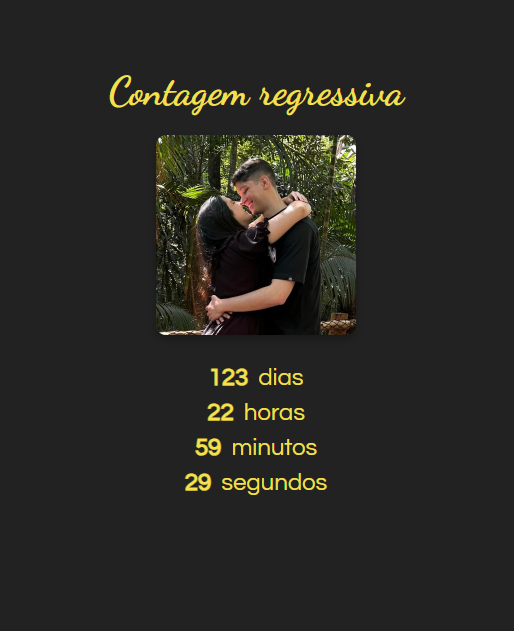

# Countdown Timer

Este é um projeto simples de contagem regressiva que exibe o tempo restante até uma data específica. Ele é construído com HTML, CSS e JavaScript.

## Funcionalidades

- Exibe o tempo restante em dias, horas, minutos e segundos até uma data alvo.
- Atualiza automaticamente a contagem regressiva a cada segundo.
- Mostra uma mensagem personalizada quando a data alvo é alcançada.

## Personalização
Para alterar a data alvo, edite a variável dataAlvo no arquivo `script.js`:
```sh
const dataAlvo = new Date('August 23, 2025 00:00:00').getTime();
```

## Exemplo de Interface

Abaixo está uma imagem de exemplo:

<div align="center">
  
</div>